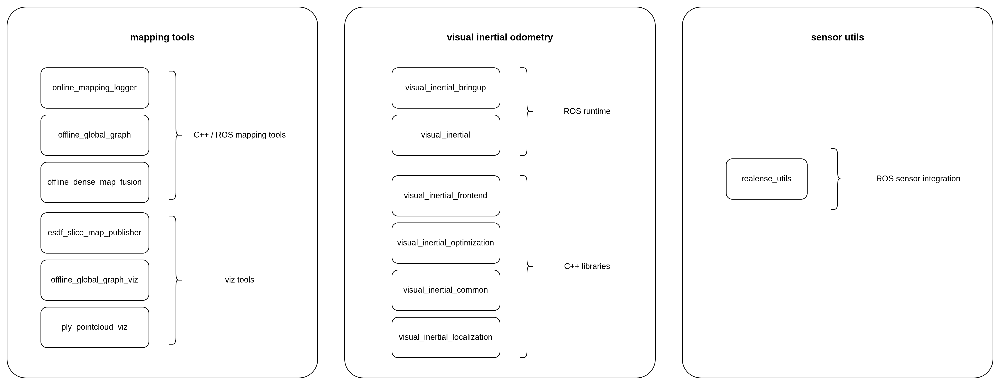
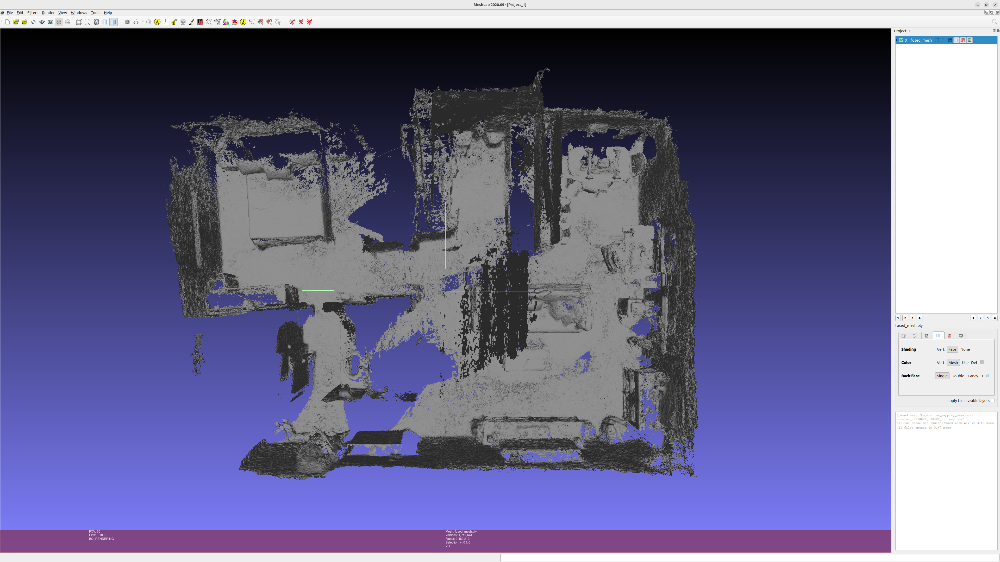
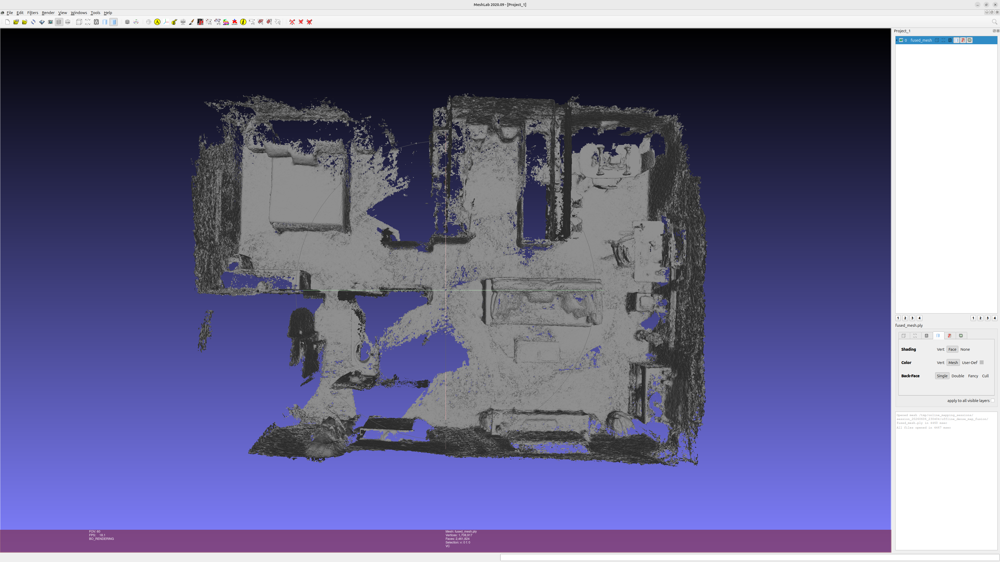
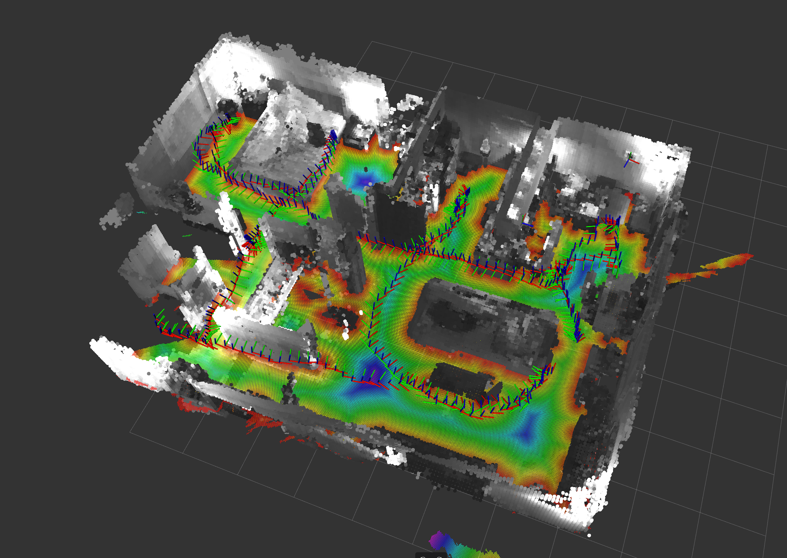
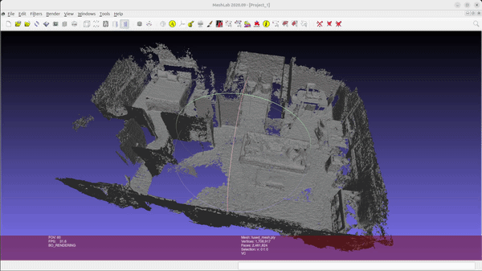

# Localization and Mapping

<p align="center">
  
</p>

This repo contains a full visual-inertial mapping stack. It covers the online estimator, the sensor-side runtime code needed to feed it clean data, and the offline tools used to log sessions, refine trajectories, build maps and visualization tools.

This was created as a means to immerse myself more in perception and SLAM strategies and components. By doing this I learned so many things that aren't in the books. It's the small tricks, heuristics and architectural decisions that make a system. I designed this thinking about 2 things: I wanted it to be conceptually clear what the components in the SLAM system are, even though I might pay a little higher price on overhead by dissecting them, and I always thought about the moment I would deploy this on a real robot with limited resources. 

It's scrappy, a little messy and far from perfect. But it's a starting point. There's so many improvements I already have in mind. Check out the section on improvements at the end of the readme.

I hope I find time to keep improving this.

## Repo layout

<p align="center">
  
</p>

### `visual_inertial_odometry`

This is the main estimator stack.

It includes:

- the stereo and IMU frontend
- AprilTag-based localization
- fixed-lag backend optimization
- ROS nodes and messages
- launch files and runtime config

Start here if you want to understand the online system:

- [`visual_inertial_odometry/README.md`](visual_inertial_odometry/README.md)

### `sensor_utils`

This is the camera and hardware side.

It exists so sensor-specific code stays out of the estimator packages. If the camera changes, this layer may change a lot while the estimator stays mostly the same.

Start here if you want to understand the current RealSense path:

- [`sensor_utils/README.md`](sensor_utils/README.md)
- [`sensor_utils/realsense_utils/README.md`](sensor_utils/realsense_utils/README.md)

### `mapping_tools`

This is the offline side of the workflow.

It starts with logged sessions and goes through offline graph optimization, dense fusion, and visualization.

Start here if you want the mapping workflow:

- [`mapping_tools/README.md`](mapping_tools/README.md)

## Get started

You can look through the READMEs I've written to get a general sense of what's going on. Each of the more complex packages should have one. As a starting point I'd recommend:

1. [`visual_inertial_odometry/README.md`](visual_inertial_odometry/README.md)
2. [`sensor_utils/realsense_utils/README.md`](sensor_utils/realsense_utils/README.md)
3. [`mapping_tools/README.md`](mapping_tools/README.md)

This README assumes a minimum level of technical knowledge and ROS familiarity.

### Dependencies & Environment

This repo spans online VIO, sensor-side runtime code, and offline mapping, so the full dependency set is a bit wider than a single package. I'm listing OS, system package versions and the packages I have on my setup (omitting ROS packages), although this might work on other versions.

The main ones are:

- Ubuntu 24.04.4 LTS
- ROS 2 Jazzy
- Linux kernel 6.17.0-20-generic
- Python 3.12.3
- CMake 3.28.3
- GCC 13.3.0
- OpenCV 4.13.0
- GTSAM 4.3
- CUDA toolkit 12.0
- nvblox 0.0.9

If you want the exact package-level view, check each package's `package.xml` and `CMakeLists.txt`.

### Installation

You can just clone this repo into your workspace and run `colcon build`. If all dependencies are met, there should be no issues. After that `source install/setup.bash` and you should be good to go!

### Typical workflows

#### Running in pure odometry mode

Note some of the realsense functions are a little flaky with emitter_on_off (at least that's what I've found). Exposure is set to manual, if you need to adjust it, you can tune `infra_exposure` and `infra_gain`.

This launches the visual inertial stack and runs a local window optimization. You can choose to not use the tracks viz, this is just an input image republisher with tracks being overlayed. You can also visualize optimized 3D points in the current window on the go, but know this starts to build up pressure. That's why I capped the amount of published points.

```
ros2 launch visual_inertial_bringup realsense_splitter_vio.launch.py \
  use_tracks_viz:=true \
  operation_mode:=mapping \
  launch_mapping_logger:=false \
  infra_exposure:=12000 \
  infra_gain:=90 \
  publish_optimized_landmarks:=true \
  lm_fetch_max:=1000
```

If you want to visualize as you go, you can launch `rviz` with the provided config file in the bringup package. 

```
rviz2 -d visual_inertial_odometry/visual_inertial_bringup/config/vio_config.rviz
```

---

#### Mapping an environment

<p align="center">
  
</p>
<p align="center">
  You can see the estimated VIO path as I map and the 3D landmarks that the optimizer is using.
</p>

##### Mapping and optimization session

1. Creating a map.

  To do this, you should run

  ```
  ros2 launch visual_inertial_bringup realsense_splitter_vio.launch.py \
    use_tracks_viz:=true \
    operation_mode:=mapping \
    infra_exposure:=13000 \
    infra_gain:=110 \
    publish_optimized_landmarks:=false \
    lm_fetch_max:=6000
  ```
  If you intend on using AprilTags as global landmarks, you can launch the apriltag ros node using your own config:

  ```
  ros2 run apriltag_ros apriltag_node --ros-args \
    -r image_rect:=/camera0/realsense_splitter_node/output/infra_1 \
    -r camera_info:=/camera0/infra1/camera_info \
    -p image_transport:=raw \
    --params-file your/path/to/tags_36h11.yaml
  ```
Again, if you want to visualize as you go, you can launch `rviz` with the provided config file in the bringup package.

```
rviz2 -d visual_inertial_odometry/visual_inertial_bringup/config/vio_config.rviz
```

Once you're done, you can exit using `ctrl + C`.

2. Running global optimization.

Note: without the use of AprilTags, this is a no-op.

--- 
**Why do we need this?**

In the example run, I moved the camera and started/ended the capture in the same position (within a centimeter). Here's what happened before and after optimization:

First/last keyframe position gap comparison

Unoptimized trajectory
- keyframes: 1 -> 432
- distance: 0.665547509423282 m
- first position: (-0.000163322, -0.0000232676, 0.0000175892)
- last position: (-0.149741, 0.644693, 0.070167)

Offline-optimized trajectory
- keyframes: 1 -> 432
- distance: 0.013156258928738063 m
- first position: (1.69447, 0.133425, 1.14636)
- last position: (1.70169, 0.126582, 1.15497)

So the offline optimization reduced the first/last position gap from about 66.6 cm to about 1.32 cm. This is with the use of an AprilTag for loop closure.

Here you can see two generated maps, one is with the raw captured poses, one is with the optimized poses.

<p align="center">
  
  
</p>
<p align="center">
  Left: Unoptimized. Right: Optimized.
</p>

---

The mapping session created a folder with all the captured data. By default, the sessions go into the `/tmp/online_mapping_sessions/` folder and the stamp of the session start is attached to the folder name. E.g. `/tmp/online_mapping_sessions/session_YYYYMMDD_HHMMSS`

You can now run optimization over the logged keyframes. If you used tag detections, the optimizer will do loop closure using tag observations. Using the tags also helps anchor the map by providing a `map-anchor-tag-id` so you can easily align the map to any tag.

Here's an example command, adjust to your session. An example for the `tag_priors.yaml` file is provided in `offline_global_graph/tag_priors.yaml`. This is a file you should provide.

```
ros2 run offline_global_graph offline_global_graph_cli \
  --session-dir /tmp/online_mapping_sessions/session_20260423_212723/ \
  --map-anchor-tag-priors mapping_tools/offline_global_graph/tag_priors.yaml \
  --map-anchor-tag-id 1
```

You can visualize the tag poses for both the optimized or unoptimized sessions by using the `offline_global_graph_viz` node. Note this only publishes transforms, you should be running rviz separately. There's a visualization example in the next subseciton, where I show generated mesh, esdf, and optimized poses.

Assuming the session is `SESSION=/tmp/online_mapping_sessions/session_YYYYMMDD_HHMMSS
`

To view the optimized poses open rviz with the given config. Then run:

```
ros2 run offline_global_graph_viz offline_global_graph_viz_node \
  --ros-args -p session_dir:=$SESSION
```

<p align="center">
  
</p>
<p align="center">
  You can see the optimized keyframes in this picture as axes. Keep going through the readme to be able to visualize the generated mesh + esdf!
</p>

To view the raw poses as captured, you can get those into a friendly format for the viz node and then visualize them:

```
# to format:
python3 mapping_tools/online_mapping_logger/scripts/export_online_optimizer_poses.py \
  "$SESSION" \
  --copy-offline-tags

# to visualize:
ros2 run offline_global_graph_viz offline_global_graph_viz_node \
  --ros-args -p session_dir:=${SESSION}_online_viz

```

##### Generating mesh/esdf and visualizing

In this section I show how to generate a mesh and a 2D slice at a chosen height. To view the generated mesh you can use `meshlab` - it's pretty cool for inspecting meshes! Or you can just use the tools I'm providing here to visualize a downsampled version in rviz.

<p align="center">
  
</p>
<p align="center">
  Mesh visualization using meshlab.
</p>

This will grab all the poses, depth and infra images and generate a mesh. The command shown here is what I used for the demo but you can tune values to your own environment and needs. The generated files get exported to the same session folder under `offline_dense_map_fusion`.

```
ros2 run offline_dense_map_fusion offline_dense_map_fusion_cli  \
  --session-dir /tmp/online_mapping_sessions/session_20260423_212723/ \
  --body-to-camera-extrinsics /tmp/online_mapping_sessions/session_20260419_215555/calibration/body_to_rgb_camera.yaml \
  --voxel-size 0.015 \
  --pixel-stride 2 \
  --min-depth 0.3 \
  --max-depth 4.0 \
  --truncation-distance-vox 2.0 \
  --max-weight 10.0 \
  --mesh-min-weight 0.6 \
  --max-world-z 2.0 \
  --esdf-slice-height 0.5
```

This is a simple node that will publish the esdf slice so you can visualize it in Rviz using the provided config file.
```
ros2 run esdf_slice_map_publisher esdf_slice_map_publisher_node --ros-args \
  -p map_yaml_path:=/tmp/online_mapping_sessions/session_20260423_212723/offline_dense_map_fusion/esdf_slice_z_0_300_occupancy.yaml \
  -p publish_once:=true \
  -p pointcloud_stride:=1 \
  -p max_pointcloud_distance_m:=0.5
```

This is a simple node that will publish a downsampled version of the generated mesh so you can visualize it in Rviz using the provided config file, we use boxes to visualize it.

```
ros2 run ply_pointcloud_viz ply_pointcloud_viz_node \
  --ros-args \
  -p ply_path:=/tmp/online_mapping_sessions/session_20260423_212723/offline_dense_map_fusion/fused_mesh.ply \
  -p frame_id:=map \
  -p voxel_size_m:=0.05 \
  -p vertex_stride:=4
```
---

#### Localizing in mapped environment

<p align="center">
  
</p>
<p align="center">
  Localization visualization.
</p>

This just runs odometry, the smoother/local window optimization, and a relocalization node which loads the optimized tag poses. The `map` is only a set of tag poses, because we don't use features in the space to localize ourselves. This means we could drift really badly if we don't see an AprilTag for while. It's just the nature of how this system works right now.

```
ros2 launch visual_inertial_bringup realsense_splitter_vio.launch.py \
  use_tracks_viz:=true \
  operation_mode:=localization \
  localization_tag_map_path:=/tmp/online_mapping_sessions/session_20260423_212723/offline_global_graph/optimized_tags.yaml \
  tag_topic:=/detections
```

You should also be running the AprilTag node.

```
ros2 run apriltag_ros apriltag_node --ros-args \
  -r image_rect:=/camera0/realsense_splitter_node/output/infra_1 \
  -r camera_info:=/camera0/infra1/camera_info \
  -p image_transport:=raw \
  --params-file your/path/to/tags_36h11.yaml
```

# Improvements

Probably a list too long ofr anyone to read, but just to name a few:
- Offline global optimization isnt really doing much right now besides closing the loop using apriltag detections and shifting the map with an anchored tag. I could leverage heavier use of features and seed poses/create between factors from the online session
- Revisit keeping vision streams/processing within GPU to reduce dense copies and waits
- Improve spatial distribution of feature tracking module. Right now to make it fast we just grid up and count the least full regions for top up. This seems to be great for speed, but should check if it's the best option. Features still cluster in certain image regions depending on motion
- Upgrade tag-based loop closure to feature-based. This is kind of a big one
- Upgrade the frame to frame visual only (fast) estimates to a filtered estimate that uses both visual and IMU information
- Cleaner launch system
- Zero-velocity updates (ZUPT). Right now the approach is to just emit a keframe at a reduced rate, even if there is no motion. Check strategy
- Initialization of IMU/accept tilted starting angles. Right now we just initialize at identity regardless of starting attitude
- Real time/live generation of ESDF/mesh
- Cleaner logging using levels, remove standard output
- Right now the system expects a static environment. Be able to tolerate dynamic objects

# Acknowledgements

- [ROS2](https://github.com/ros2) - Probably not in enough acknowledgements. The core middleware that makes this integration easy.
- [GTSAM](https://github.com/borglab/gtsam) - Sick package for optimization. Without this, getting to the current point would have taken so much longer. If I ever got there.
- [Isaac ROS Nvblox](https://github.com/NVIDIA-ISAAC-ROS/isaac_ros_nvblox) - Great open source library for mesh generation on CUDA capable hardware.
- [Isaac ROS Visual SLAM / cuVSLAM](https://github.com/NVIDIA-ISAAC-ROS/isaac_ros_visual_slam) - The package from which I took inspiration for some architecture and functionality.
