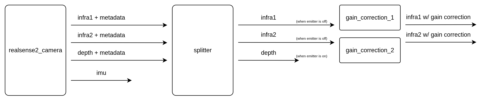

# realsense_utils

## Overview

`realsense_utils` holds the realsense specific runtime code used by visual_inertial.

It is not part of the estimator itself. It brings up the camera stack, splits the RealSense streams into the set the rest of the system wants, and can optionally apply per-pixel gain correction to the IR images.

<p align="center">
  
</p>

The splitter node is a pretty smart trick. Basically, we want to use the IR projector to get better depth, but that projected pattern is visible in IR streams, which we also use to detect features. Hopefully you see where this is going. Using the projectors basically generates fake features and will break our tracker. So what we do here is time splitting. The realsense offers an `emitter_on_off` mode where it alternates the state of the projector on/off frame to frame. By doing this, we get clean infra images, and we get depth images with clean depth, as those are captured while the projector is on. The price we pay (among others) is that our tracking and depth sensing are a captured at a different time. But the motion of our robot is relatively slow with respect to that time difference, so we can get away with it without doing fancy time compensation.

The splitter node is mostly taken from Nvidia's Isaac ROS examples, with light modifications. The gain correction is a very scrappy but almost good enough filter that corrects for vignetting on the realsense infra cameras. I made this because the vignette was showing up very noticeably in the created meshes. This helps but of course doesnt fully solve, as it is eyeballed and assumes the vignette is at the center fo the frame, has a constant radial decay, etc.

## Functionality

This package provides:

- RealSense bringup through a single launch entry point
- a splitter node that republishes IR, depth, and pointcloud streams based on emitter state
- optional gain correction nodes for the left and right IR streams
- two camera presets
- one preset for the splitter pipeline
- one preset for a plain emitter-on depth and color setup
- a small tuning script for gain maps

## What this package owns

The package contains:

- [launch/realsense.launch.py](launch/realsense.launch.py)
- [src/realsense_splitter_node.cpp](src/realsense_splitter_node.cpp)
- [src/infra_gain_correction_node.cpp](src/infra_gain_correction_node.cpp)
- sensor configs under [config/sensors/](config/sensors)
- [scripts/infra_gain_map_tuner.py](scripts/infra_gain_map_tuner.py)

## Main nodes

### `realsense_splitter_node`

This node subscribes to:

- `infra1` plus metadata
- `infra2` plus metadata
- `depth` plus metadata
- optional pointcloud plus metadata

It uses the RealSense metadata field `frame_emitter_mode` to decide what to republish:

- IR frames are republished only when the emitter is off
- depth and pointcloud are republished only when the emitter is on

The point is to get a stable pair of IR images for tracking while still keeping active depth from the same camera.

In the default launch wiring, the outputs end up under:

- `/<camera>/realsense_splitter_node/output/infra_1`
- `/<camera>/realsense_splitter_node/output/infra_2`
- `/<camera>/realsense_splitter_node/output/depth`
- `/<camera>/realsense_splitter_node/output/pointcloud`

If gain correction is enabled, the splitter first publishes the raw IR images to:

- `/<camera>/realsense_splitter_node/raw/infra_1`
- `/<camera>/realsense_splitter_node/raw/infra_2`

Then the correction nodes publish the final `output/infra_1` and `output/infra_2` topics.

### `infra_gain_correction_node`

This node subscribes to a mono image topic, multiplies the image by a float32 gain map loaded from a `.npy` file, and republishes the corrected image.

It supports:

- `mono8`
- `mono16`

If no gain map is configured, or if the gain map cannot be applied, it passes the image through unchanged and logs a warning.

## Launch

Main entry point:

```bash
ros2 launch realsense_utils realsense.launch.py
```

This launch file starts a composable container and loads:

- one or more `realsense2_camera` nodes
- `realsense_splitter_node` for the first camera by default
- optional gain correction nodes for the splitter IR outputs

The default container name is:

- `realsense_utils_container`

Important launch args:

- `run_standalone`
- `container_name`
- `num_cameras`
- `camera_serial_numbers`
- `intra_process_comms`
- `enable_infra_gain_correction`
- `infra_gain_map_path`
- `resize_gain_map_to_image`
- `auto_retoggle_emitter_on_off`
- `emitter_retoggle_delay_sec`

One detail worth knowing is the delayed parameter retoggle path. After the RealSense node comes up, the launch file can wait for the dynamic params to exist and then retoggle emitter and exposure settings from the CLI. That is there because those params are not declared right away at node startup. This was causing so many issues, there seems to be some bug in the realsense ros node or the lib, anyway, this hack works.

## Camera configs

The launch file uses two YAML presets:

- [config/sensors/realsense_emitter_flashing.yaml](config/sensors/realsense_emitter_flashing.yaml)
- [config/sensors/realsense_emitter_on.yaml](config/sensors/realsense_emitter_on.yaml)

The current split is:

- `realsense_emitter_flashing.yaml`
- used for the camera that runs the splitter
- IR and IMU enabled
- emitter toggled across frames
- `realsense_emitter_on.yaml`
- used for cameras that are not running the splitter
- plain depth plus color setup

## Gain map tuning

[scripts/infra_gain_map_tuner.py](scripts/infra_gain_map_tuner.py) is there to help build or tune the gain map used by `infra_gain_correction_node`.
