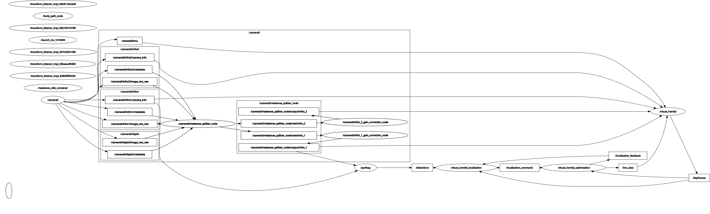

# visual_inertial

## Overview

ROS 2 runtime package for the visual inertial stack.

This package is the ROS boundary for the rest of `visual_inertial_odometry`. It owns the executable nodes, message definitions, launch files and the transport code that converts between ROS messages and the underlying C++ library types.

The logic itself lives in the library packages (or so I tried):

- [`visual_inertial_frontend`](../visual_inertial_frontend)
- [`visual_inertial_localization`](../visual_inertial_localization)
- [`visual_inertial_optimization`](../visual_inertial_optimization)

This package is what turns those libraries into a running ROS system.

## What this package owns

This package contains:

- the main runtime nodes
  - `visual_inertial` (executable: `tracking_node`)
  - `localization_node`
  - `optimization_node`
- helper visualization nodes
  - `tracks_viz_node`
  - `path_viz_node`
- the ROS message types exchanged between nodes
- launch files and parameter files
- node parameter handlers
- the transport layer under `src/transport` that converts between ROS messages and the shared or library types

## Runtime modes

Two main runtime modes are supported.

Mapping mode:

- `visual_inertial -> optimization_node`

In this mode, the frontend publishes keyframes and the backend optimizes them without tag based global correction.

<p align="center">
  
</p>

Localization mode:

- `visual_inertial -> localization_node -> optimization_node`
- `optimization_node -> localization_node` feedback

In this mode, the localization node watches tag detections and keyframes, sends localization commands to the optimizer, and receives backend `map -> odom` feedback back from the optimizer.

<p align="center">
  
</p>

## Main nodes

### `visual_inertial` (`tracking_node`)

The `visual_inertial` node wraps [`visual_inertial_frontend`](../visual_inertial_frontend).

It mainly:

- subscribes to stereo images, camera info, and IMU
- feeds IMU bias updates back into the frontend
- publishes tracks and frontend health
- publishes finalized keyframes for the backend
- publishes the frontend odometry TF

### `localization_node`

`localization_node` wraps [`visual_inertial_localization`](../visual_inertial_localization).

It mainly:

- subscribes to keyframes
- subscribes to AprilTag detections
- uses TF to resolve detections into body frame observations
- publishes `LocalizationCommand`
- subscribes to `LocalizationFeedback`

### `optimization_node`

`optimization_node` wraps [`visual_inertial_optimization`](../visual_inertial_optimization).

It mainly:

- subscribes to keyframes
- optionally waits for localization commands in localization mode
- runs backend updates at keyframe rate
- publishes optimized state summaries
- publishes IMU bias feedback
- publishes localization feedback
- publishes the `map -> odom` TF

### Helper nodes

The package also includes lightweight helper nodes:

- `tracks_viz_node` for feature track overlays
- `path_viz_node` for a body path view from TF

## Messages and transport

This package defines the ROS seam between the runtime nodes. The messages under [`msg/`](msg) are the public ROS side of that seam.

The main ones are:

- `Keyframe.msg`
- `Tracks.msg`
- `FrontendHealth.msg`
- `FrontendIntervalHealth.msg`
- `OptimizationResult.msg`
- `OptimizationStats.msg`
- `OptimizedKeyframePose.msg`
- `ImuBias.msg`
- `LocalizationCommand.msg`
- `LocalizationFeedback.msg`
- `LocalizationPosePrior.msg`

The transport layer under [`src/transport`](src/transport) converts between these ROS messages and the internal C++ types used by the frontend, localization, optimization, and common packages.

In practice, this is one of the main reasons this package exists: the libraries stay mostly ROS-free, and `visual_inertial` handles the message side.

## Configuration

This package owns the runtime configuration surface.

The main places to look are:

- launch files under [`launch/`](launch)
- parameter files under [`config/`](config)
- node parameter headers under [`include/visual_inertial/`](include/visual_inertial)

The main entry points right now are:

- [launch/realsense_splitter_vio.launch.py](launch/realsense_splitter_vio.launch.py)
- [config/visual_inertial_params_realsense_splitter.yaml](config/visual_inertial_params_realsense_splitter.yaml)

Each node declares and owns its own runtime parameters, but this package is where those parameters are exposed and wired into the running system.

## Tests

This package includes launch-based node graph tests that run with `colcon test`:

- [test/test_mapping_mode_node_graph.py](test/test_mapping_mode_node_graph.py)
- [test/test_localization_mode_node_graph.py](test/test_localization_mode_node_graph.py)

These tests check that the main node graph comes up and that the important topic wiring is present in mapping mode and localization mode.

Run them with:

```bash
colcon test --base-paths . --packages-select visual_inertial --event-handlers console_direct+
colcon test-result --verbose --test-result-base build/visual_inertial
```
