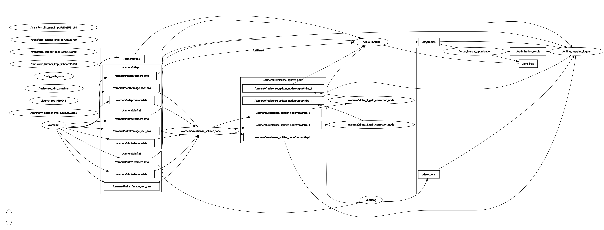

# visual_inertial_bringup

Bringup package for the visual inertial stack.

This package owns the launch files, the default runtime YAML, and the launch tests for mapping mode and localization mode. The nodes, messages, and transport code still live in [`visual_inertial`](../visual_inertial).

## Overview

`visual_inertial_bringup` is the package that actually starts the system used in this repo.

It wires together:

- `visual_inertial`
- `realsense_utils`
- `online_mapping_logger` in mapping mode

This keeps launch-time dependencies out of the core runtime package.

## What this package owns

This package contains:

- the main launch entry point
- the default runtime YAML
- bringup-level launch arguments
- launch tests for mapping mode and localization mode

The main files are:

- [launch/realsense_splitter_vio.launch.py](launch/realsense_splitter_vio.launch.py)
- [config/visual_inertial_params_realsense_splitter.yaml](config/visual_inertial_params_realsense_splitter.yaml)

## What gets launched

The launch file can start nodes from three packages:

- [`visual_inertial`](../visual_inertial)
  - `visual_inertial` from `tracking_node`
  - `visual_inertial_optimization` from `optimization_node`
  - `visual_inertial_localization` from `localization_node`
  - `tracks_viz_node`
  - `body_path_node`
- `realsense_utils`
  - the RealSense bringup included through its own `realsense.launch.py`
  - in the current setup that means the camera stack under `/camera0`, the splitter node, and the utility container
- [`online_mapping_logger`](../../mapping_tools/online_mapping_logger)
  - `online_mapping_logger`
  - mapping mode only

Which ones actually come up depends on the mode and the launch flags.

## Runtime modes

The launch file supports two modes.

### Mapping

Starts:

- `visual_inertial` package
  - `visual_inertial`
  - `visual_inertial_optimization`
  - optional `tracks_viz_node`
  - optional `body_path_node`
- `realsense_utils` package if `launch_realsense:=true`
- `online_mapping_logger` package by default
  - `online_mapping_logger`

This is the mode for backend optimization without tag-based global correction. By default it also records a mapping session.

<p align="center">
  
</p>

### Localization

Starts:

- `visual_inertial` package
  - `visual_inertial`
  - `visual_inertial_localization`
  - `visual_inertial_optimization`
  - optional `tracks_viz_node`
  - optional `body_path_node`
- `realsense_utils` package if `launch_realsense:=true`

This is the mode for tag-based global correction on top of the same frontend and backend.

<p align="center">
  
</p>

## Launch

Main entry point:

```bash
ros2 launch visual_inertial_bringup realsense_splitter_vio.launch.py
```

Explicit mapping mode:

```bash
ros2 launch visual_inertial_bringup realsense_splitter_vio.launch.py operation_mode:=mapping
```

Localization mode:

```bash
ros2 launch visual_inertial_bringup realsense_splitter_vio.launch.py operation_mode:=localization
```

Pure odometry / backend mode without the logger:

```bash
ros2 launch visual_inertial_bringup realsense_splitter_vio.launch.py \
  operation_mode:=mapping \
  launch_mapping_logger:=false
```

## Launch arguments

The main launch arguments are:

- `operation_mode`
  - `mapping` or `localization`
- `launch_realsense`
  - whether to start the RealSense stack from `realsense_utils`
- `camera_serial_numbers`
  - passed through to the RealSense bringup
- `startup_delay_s`
  - delay before starting the VIO nodes
- `use_tracks_viz`
  - enables `tracks_viz_node`
- `use_path_viz`
  - enables `body_path_node`
- `launch_mapping_logger`
  - mapping mode only
- `params_file`
  - override for the main runtime YAML
- `logger_params_file`
  - override for the logger YAML

## Configuration

The default runtime YAML is:

- [config/visual_inertial_params_realsense_splitter.yaml](config/visual_inertial_params_realsense_splitter.yaml)

That file carries the default params for:

- `visual_inertial`
- `visual_inertial_optimization`
- `visual_inertial_localization`
- `tracks_viz_node`
- `body_path_node`

The logger keeps its own YAML in `online_mapping_logger`. If `logger_params_file` is left empty, the launch file looks up that package's default config at runtime.

## Tests

This package owns the launch tests that check the runtime node graph:

- [test/test_mapping_mode_node_graph.py](test/test_mapping_mode_node_graph.py)
- [test/test_localization_mode_node_graph.py](test/test_localization_mode_node_graph.py)

Run them with:

```bash
colcon test --base-paths . --packages-select visual_inertial_bringup --event-handlers console_direct+
colcon test-result --verbose --test-result-base build/visual_inertial_bringup
```

## Relationship To visual_inertial

The split is:

- [`visual_inertial`](../visual_inertial)
  - nodes, messages, transport
- `visual_inertial_bringup`
  - launch files, runtime YAML, launch tests

That keeps package dependencies cleaner, especially when bringup wants to start optional tools like `online_mapping_logger`.
