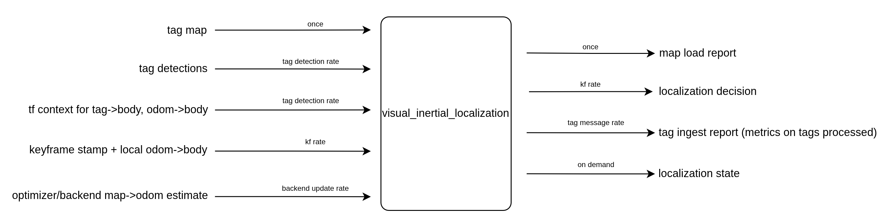

# visual_inertial_localization

## Overview

Tag based global correction library for the visual inertial stack.

<p align="center">
  
</p>

The goal of this package is to provide global corrections from mapped features. In this implementation, those features are AprilTags. That cuts out a lot of the complexity of general feature matching against a map. The tradeoff is sparse corrections: no visible tag means no correction.

As the diagram shows, the module takes in a tag map, AprilTag detections, TF context for `tag -> body` and `odom -> body`, the keyframe stamp plus local `odom -> body` pose, and the latest backend `map -> odom` estimate.

From those inputs it decides whether to stay on odometry, add global priors, bootstrap into localized mode, or relocalize when drift is too large. The main outside facing outputs are a `TagIngestReport` at tag message rate and a `LocalizationDecision` at keyframe rate.

This package does not optimize a graph or publish ROS topics on its own. It filters tag observations, estimates stable `map -> odom` corrections, and turns those estimates into optimizer commands.

Its outputs are event driven rather than frame rate outputs. A keyframe may produce no correction, a set of pose priors, an initial bootstrap, or a relocalization request depending on the current localization state and the quality of the tag observations.

## Functionality

This package does the following:

- loading a mapped tag layout from YAML
- ingesting AprilTag detections with TF based pose lookup
- filtering detections by whether the tag exists in the loaded map, hamming distance, decision margin, range, and viewing angle
- buffering recent tag observations
- estimating stable global correction candidates from recent detections
- deciding when to bootstrap from odometry only mode into localized mode
- deciding when to provide tracking priors versus when to trigger relocalization
- packaging optimizer facing localization inputs

It does not own feature tracking, graph optimization, or ROS nodes.

## Public API

The main public class is [`LocalizationModule`](include/visual_inertial_localization/localization.hpp), defined in `localization.hpp`.

Typical usage looks like:

```cpp
#include "visual_inertial_localization/localization.hpp"

LocalizationModule localization(config);
localization.loadTagMap(); // path is in the config

localization.ingestDetections(detection_msg, body_frame_id, odom_frame_id, tf_buffer);

LocalizationDecision decision =
    localization.processKeyframe(stamp_ns, T_OB); // evaluate the current keyframe against the latest local pose

localization.updateMapOdomEstimate(T_MO_backend); // feed back the backend estimate after optimization
```

`ingestDetections(...)` returns a [`TagIngestReport`](include/visual_inertial_localization/localization_data.hpp) that tells you how many detections were accepted or rejected by each gate. `processKeyframe(...)` returns a [`LocalizationDecision`](include/visual_inertial_localization/localization_types.hpp) with the current localization state and any optimizer inputs that should be applied at that keyframe.

## Processing flow

The package has three connected flows built around a shared observation buffer and a controller state machine.

The first is tag map loading:

1. `loadTagMap()` reads the configured YAML file.
2. Valid tag entries are converted into fixed `map -> tag` transforms.
3. Invalid or incomplete entries are skipped.
4. The module stores the mapped tags for later lookup during detection ingest and correction estimation.

The second is tag ingest and correction estimation:

1. `ingestDetections(...)` receives a new AprilTag detection array.
2. Each detection is checked against the mapped tag set, hamming threshold, decision margin threshold, TF lookup, range threshold, and oblique angle threshold.
3. Accepted observations are appended to the recent observation buffer.
4. The module drops old buffered observations according to the configured time window.
5. Using the accepted detections and the current `odom -> body` TF, the module updates temporal correction hypotheses for `map -> odom`.

The third is keyframe level decision making:

1. `processKeyframe(...)` evaluates the current keyframe stamp and local `odom -> body` pose.
2. If the module is still in `OdomOnly`, it looks for enough stable correction evidence to bootstrap into `Localized`.
3. If the module is already `Localized`, it compares the current `map -> odom` estimate against stable and relocalization correction hypotheses.
4. Depending on the disagreement and support, it either emits no action, pose priors, or a relocalization request.
5. The caller later feeds the backend result back through `updateMapOdomEstimate(...)` so future decisions use the latest global alignment.

This split is why the package is not just a tag detector wrapper. Detection ingest builds correction evidence over time, while keyframe processing turns that evidence into optimizer inputs.

## Important data structures

The most important structures in this package are:

- [`LocalizationConfig`](include/visual_inertial_localization/localization_data.hpp): top level configuration for tag ingest gates, correction clustering, and localization thresholds
- [`LocalizationDecision`](include/visual_inertial_localization/localization_types.hpp): keyframe level output that describes the current localization state, requested action, and optimizer inputs
- [`LocalizationOptimizerInputs`](include/visual_inertial_localization/localization_types.hpp): the absolute pose priors and optional initialization or anchor overrides that the optimizer should apply
- [`LocalizationPosePrior`](include/visual_inertial_localization/localization_types.hpp): one optimizer facing absolute pose prior with configured uncertainty and optional robust loss
- [`TagIngestReport`](include/visual_inertial_localization/localization_data.hpp): summary of what happened when a detection message was ingested
- [`StableCorrectionEstimate`](include/visual_inertial_localization/localization_data.hpp): stable `map -> odom` correction estimate built from buffered tag evidence
- [`BootstrapEstimate`](include/visual_inertial_localization/localization_data.hpp): initial correction estimate used to enter localized mode
- [`LocalizationBootstrapInfo`](include/visual_inertial_localization/localization_types.hpp) and [`LocalizationRelocalizationInfo`](include/visual_inertial_localization/localization_types.hpp): lightweight summaries attached to the final decision

## Parameters

The top level params are defined in [`LocalizationConfig`](include/visual_inertial_localization/localization_data.hpp). The easiest way to read them is by group.

Tag sources and buffering:

- `tag_map_path`: path to the YAML tag map used to anchor detections in the map frame
- `tag_topic`: expected ROS topic name for tag detections at the node layer
- `tag_tf_lookup_timeout_ms`: TF lookup timeout used when converting detections into body frame observations
- `tag_max_age_s`: maximum age of buffered observations that may still contribute to current estimates
- `tag_buffer_age_s`: maximum age of observations retained in the internal rolling buffer
- `tag_frame_overrides`: optional per tag frame names used instead of the default `family:id` convention

Detection quality gates:

- `max_tag_hamming`: maximum accepted tag decoding error
- `min_tag_decision_margin`: minimum decision margin required for a detection to be used
- `max_tag_range_m`: maximum accepted body to tag range
- `max_tag_oblique_angle_deg`: maximum accepted viewing angle away from a head on observation

Pose prior tuning:

- `pose_prior_rot_sigma_rad`: rotation sigma used when building optimizer pose priors
- `pose_prior_trans_sigma_m`: translation sigma used when building optimizer pose priors
- `pose_prior_huber_k`: Huber loss scale used for robust tracking priors

Correction clustering and stability:

- `cluster_translation_m`: translation threshold used to cluster pose hypotheses together
- `cluster_rotation_deg`: rotation threshold used to cluster pose hypotheses together
- `stable_hypothesis_age_s`: maximum age of temporal correction hypotheses kept in the stable correction buffer
- `stable_min_frames`: minimum frame support required before a stable correction is treated as valid
- `relocalization_min_history_frames`: minimum frame support required before a correction may trigger relocalization
- `stable_translation_m`: translation tolerance used when evaluating whether corrections agree across time
- `stable_rotation_deg`: rotation tolerance used when evaluating whether corrections agree across time

Decision thresholds:

- `relocalize_translation_m`: translation disagreement required before relocalization is requested
- `relocalize_rotation_deg`: rotation disagreement required before relocalization is requested
- `tracking_deadband_translation_m`: translation deadband below which no tracking prior is emitted
- `tracking_deadband_rotation_deg`: rotation deadband below which no tracking prior is emitted

For the exact defaults and types, use the header definitions as the source of truth.

## Core headers

- `localization.hpp`: main public API package entry point
- `localization_data.hpp`: configuration and estimate or report types used by tag ingest and correction estimation
- `localization_types.hpp`: localization state, action, and optimizer facing decision types

## Main components

[`LocalizationModule`](include/visual_inertial_localization/localization.hpp) is the public API and ties the estimator and controller together.

The internal `LocalizationEngine` loads the tag map, filters detections, stores recent tag observations, and estimates stable correction hypotheses over time.

The internal `LocalizationController` owns the localization state machine and turns correction evidence into bootstrap, tracking prior, or relocalization decisions.

The split keeps evidence gathering separate from the policy that decides what the optimizer should do with that evidence.

## Outputs

The package produces two main kinds of output.

Ingest rate output:

- [`TagIngestReport`](include/visual_inertial_localization/localization_data.hpp)

This tells you how many detections were accepted, how many were rejected by each gate, and how many observations remain buffered after ingest.

Keyframe rate output:

- [`LocalizationDecision`](include/visual_inertial_localization/localization_types.hpp)

This contains the current localization state, the requested action, and the optimizer inputs to apply for the current keyframe.

Together, these outputs let downstream code inspect both the quality of the incoming tag stream and the higher level localization decisions derived from it.

## Dependencies

This package depends mainly on:

- `apriltag_msgs` for the detection message type consumed by the façade
- `tf2_ros` for resolving tag and body poses at detection time
- `yaml-cpp` for tag map loading
- Eigen for rigid transforms and distance calculations

In practice, the localization module assumes:

- a mapped AprilTag environment
- consistent TF between the body, tag, and odom frames at ingest time
- keyframe timestamps in the same time domain as the incoming detection stream

## Tests

The package has unit tests wired into `colcon test`:

- [`test_localization_engine.cpp`](test/test_localization_engine.cpp)
- [`test_localization_controller.cpp`](test/test_localization_controller.cpp)

Run them with:

```bash
colcon test --base-paths . --packages-select visual_inertial_localization --event-handlers console_direct+
colcon test-result --verbose --test-result-base build/visual_inertial_localization
```

## Relationship To The Node Layer

This package is a library only. ROS topic wiring, TF integration at the node boundary, and message conversion into the localization command and feedback protocol live in [`visual_inertial`](../visual_inertial), which uses `LocalizationModule` as the localization library underneath the node.
