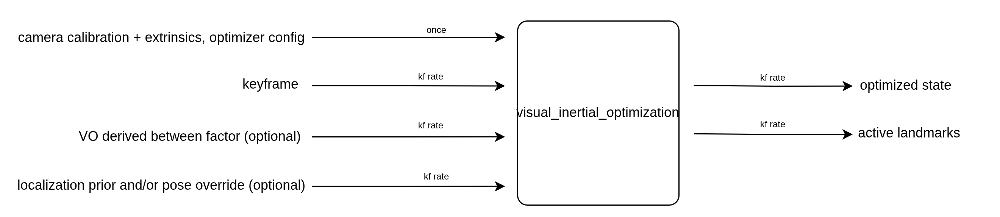
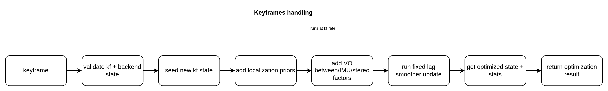

# visual_inertial_optimization

## Overview

Fixed lag backend for the visual inertial stack.

<p align="center">
  
</p>

The goal of this package is to take finalized keyframes and keep a consistent local state estimate over a sliding window. It combines stereo observations, IMU preintegration, optional VO between measurements, and optional global pose priors or overrides.

In this context, the backend state mainly means the current pose estimates, velocity estimates, IMU bias estimates, and the landmarks that are still alive in the active window. A keyframe is the frontend's packaged update for one step of the backend, with tracked stereo observations, a local pose guess, interval health, and optionally an IMU packet.

This package owns the graph update and smoothing step, but not ROS topics or TF publishing. It takes in backend ready keyframe data and returns optimized poses, bias, velocity, landmark estimates, and update stats.

Its main output is event driven at keyframe rate. Each accepted keyframe can produce one optimization update, or no result at all if the backend is not ready or the input is invalid.

## Functionality

This package does the following:

- initialize the backend from a valid stereo rig
- accept finalized keyframes from the frontend
- add stereo factors for tracked landmarks
- add IMU factors for consecutive keyframes when IMU is enabled
- add optional VO between factors
- gate VO between and stereo strength using interval health
- apply absolute pose priors and optional initialization or anchor overrides
- run the fixed lag smoother update
- return optimized state and update stats
- expose active landmark estimates for visualization or debugging

It does not own ROS nodes, topic wiring, or localization policy.

## Public API

The main public class is [`OptimizationModule`](include/visual_inertial_optimization/optimization.hpp), defined in `optimization.hpp`.

Typical usage looks like:

```cpp
#include "visual_inertial_optimization/optimization.hpp"

OptimizationModule optimization(config);
optimization.initializeRig(rig);

auto result = optimization.push(
    keyframe,
    T_Bkm1_Bk_meas,
    absolute_pose_priors,
    T_WB_init_override,
    T_WB_anchor_override);

auto landmarks = optimization.getLandmarks();
```

`push(...)` returns an optional [`OptimizationResult`](include/visual_inertial_optimization/types.hpp). You get a result when the module is initialized, the keyframe passes the basic input checks, and the smoother update succeeds.

## Processing flow

<p align="center">
  
</p>

The diagram above shows the main runtime path through the backend. Everything there happens at keyframe rate and is centered on `push(...)`.

1. `push(...)` takes the keyframe update plus the optional VO between measurement, localization priors, and localization overrides.
2. The backend first checks that the keyframe and current backend state are usable.
3. Bad updates are rejected early. That includes invalid rig state, duplicate or out of order keyframes, malformed track payloads, or missing IMU data when IMU is required.
4. It then seeds the new keyframe state. By default that comes from the keyframe's local `T_OB`, but localization can override the initial pose, and on the first keyframe it can also override the anchor pose.
5. Any localization priors passed into `push(...)` are added as pose prior factors.
6. The backend then adds the regular measurement factors:
   - VO between if a measurement is present and interval health does not force it to be skipped
   - IMU if IMU mode is enabled and the preintegrated packet is present
   - stereo factors for tracks with a valid right observation
7. On the very first accepted keyframe, the backend also adds pose, velocity, and bias priors to start the graph.
8. For new stereo landmarks, the backend can initialize them directly from disparity.
9. The fixed lag smoother update runs on the new factors, values, and timestamps.
10. If the update succeeds, the backend reads back the optimized pose, velocity, bias, active keyframe poses, covariances, and update stats.
11. That data is returned as an `OptimizationResult`.

So this is not just a thin optimizer wrapper. It also decides which measurements are worth trusting, how a new keyframe enters the graph, and what summary of the update gets handed back to the caller.

## Important data structures

The most important structures in this package are:

- [`OptimizationConfig`](include/visual_inertial_optimization/optimization.hpp): top level configuration for the backend window, factor noise, IMU usage, VO between gating, and stereo landmark handling
- [`OptimizationResult`](include/visual_inertial_optimization/types.hpp): keyframe rate output containing the optimized body and camera poses, active keyframe poses, bias, velocity, optional covariances, and update stats
- [`OptimizationStats`](include/visual_inertial_optimization/types.hpp): counts and quality information for the latest update, including which factor types were added or skipped
- [`AbsolutePosePrior`](include/visual_inertial_optimization/types.hpp): one optimizer facing absolute pose prior with uncertainty and optional robust loss
- [`LandmarkEstimate`](include/visual_inertial_optimization/optimization.hpp): exported landmark estimate with track id, world position, and last seen keyframe
- [`OptimizedKeyframePoseEstimate`](include/visual_inertial_optimization/types.hpp): optimized pose summary for each active keyframe in the current window

The package also leans heavily on [`KeyframeEvent`](../visual_inertial_common/include/visual_inertial_common/types.hpp), which is the finalized frontend payload used as the main input to `push(...)`.

## Parameters

The top level params are defined in [`OptimizationConfig`](include/visual_inertial_optimization/optimization.hpp). The easiest way to read them is by group.

Window and rig setup:

- `window_size`: number of keyframes kept in the fixed lag window
- `rig`: stereo rig model used by the backend
- `T_BC`: body to camera transform used to relate body and left camera states

Stereo factors:

- `stereo_sigma_px`: base pixel noise used for stereo factors
- `stereo_huber_k`: Huber loss scale used on stereo factors
- `init_landmarks_from_stereo`: whether new landmarks should be initialized directly from stereo disparity
- `prune_unobserved_landmarks`: whether stale landmarks should be dropped when they leave the active window

Bootstrap priors:

- `prior_rot_sigma_rad`: pose prior rotation sigma used on the first keyframe
- `prior_trans_sigma_m`: pose prior translation sigma used on the first keyframe
- `vel_prior_sigma`: velocity prior sigma used on the first keyframe
- `bias_acc_prior_sigma`: accelerometer bias prior sigma used on the first keyframe
- `bias_gyro_prior_sigma`: gyroscope bias prior sigma used on the first keyframe

VO between factors:

- `use_vo_between`: whether to use the frontend relative motion measurement as a between factor
- `between_rot_sigma_rad`: base rotation sigma for VO between factors
- `between_trans_sigma_m`: base translation sigma for VO between factors
- `between_huber_k`: Huber loss scale for VO between factors

Interval health gating:

- `use_interval_health_for_vo_between`: whether to scale or skip VO between and stereo based on frontend interval health
- `between_health_min_pose_valid_fraction`: minimum pose valid fraction used when scoring interval health
- `between_health_min_track_retention`: minimum track carryover used when scoring interval health
- `between_health_min_pnp_inlier_ratio`: minimum PnP inlier ratio used when scoring interval health
- `between_health_min_track_coverage`: minimum image coverage used when scoring interval health
- `between_health_max_pnp_reproj_rmse_px`: maximum reprojection error used when scoring interval health
- `between_health_max_sigma_scale`: maximum factor noise inflation when health is weak but still usable
- `between_health_skip_quality`: score below which VO between or stereo should be skipped for that interval

IMU:

- `use_imu`: whether to require and use preintegrated IMU measurements between keyframes

For the exact defaults and types, use the header definitions as the source of truth.

## Core headers

- `optimization.hpp`: main public API package entry point
- `types.hpp`: optimization result, stats, and prior types used across the public interface

## Main components

[`OptimizationModule`](include/visual_inertial_optimization/optimization.hpp) is the public API and owns the thread safe package boundary.

The internal `Optimizer` owns the actual fixed lag smoother, factor graph update logic, active window bookkeeping, landmark management, and state extraction.

The split keeps the public surface small while leaving the backend code free to manage the graph, smoothing state, and factor setup.

## Outputs

The package produces two main kinds of output.

Keyframe rate output:

- [`OptimizationResult`](include/visual_inertial_optimization/types.hpp)

This contains the optimized body and camera poses for the latest keyframe, the active keyframe poses still in the window, the optimized IMU bias and velocity, optional covariance blocks, and a stats summary for the latest update.

On demand output:

- `std::vector<LandmarkEstimate>` from `getLandmarks(...)`

This returns the landmarks the backend still tracks in the current window.

Together, these outputs let downstream code use the backend both as the current optimized pose source and as a source of debug or visualization state.

## Dependencies

This package depends mainly on:

- GTSAM for the fixed lag smoother, factor graph, stereo factors, and IMU factors
- Eigen for rigid transforms
- OpenCV point types carried through the frontend keyframe payload
- [`visual_inertial_common`](../visual_inertial_common) for `CameraRig`, `KeyframeEvent`, `ImuBias`, and other shared types

In practice, the backend assumes:

- a valid stereo rig has been provided before `push(...)`
- keyframes arrive in increasing order
- IMU packets are present and consecutive when IMU mode is enabled
- frontend interval health carries meaningful quality information when VO between gating is enabled

## Tests

The package has unit tests wired into `colcon test`:

- [`test_optimization_module.cpp`](test/test_optimization_module.cpp)

Run them with:

```bash
colcon test --base-paths . --packages-select visual_inertial_optimization --event-handlers console_direct+
colcon test-result --verbose --test-result-base build/visual_inertial_optimization
```

## Relationship To The Node Layer

This package is a library only. ROS topic wiring, TF publishing, localization command handling, and result publishing live in [`visual_inertial`](../visual_inertial), which uses `OptimizationModule` underneath `optimization_node`.
